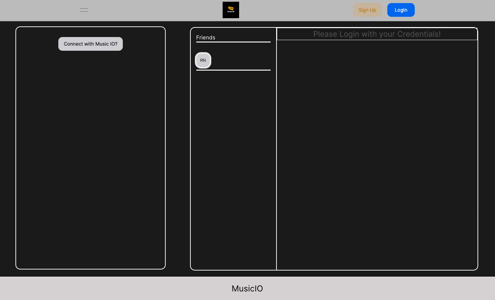
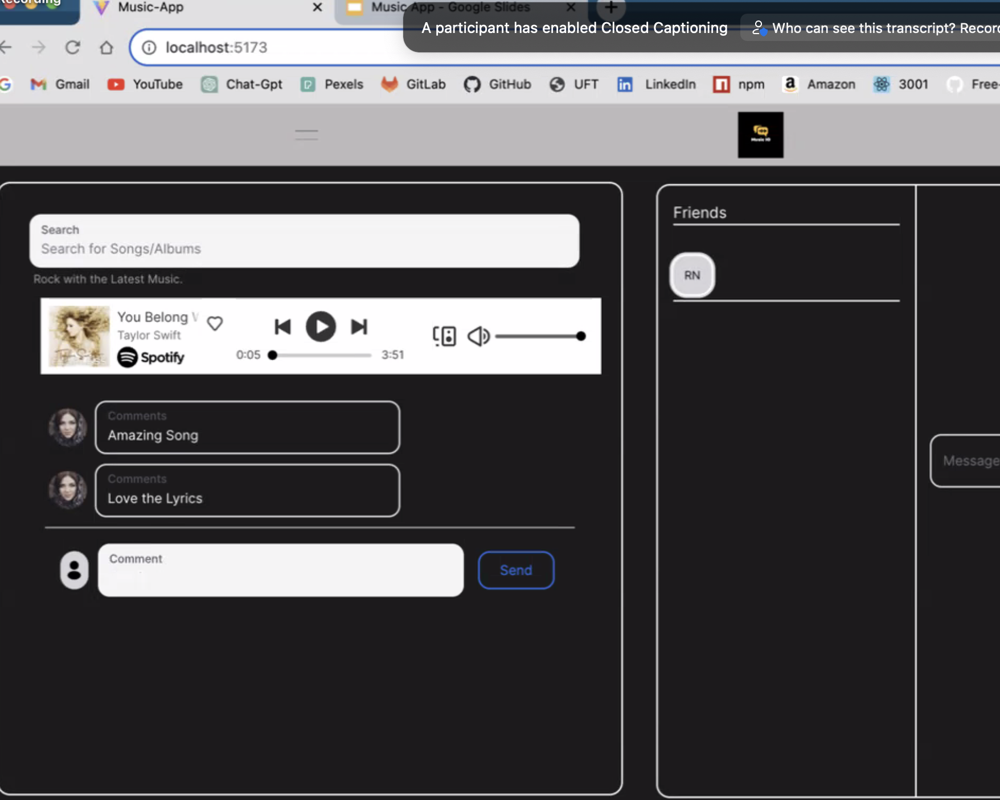
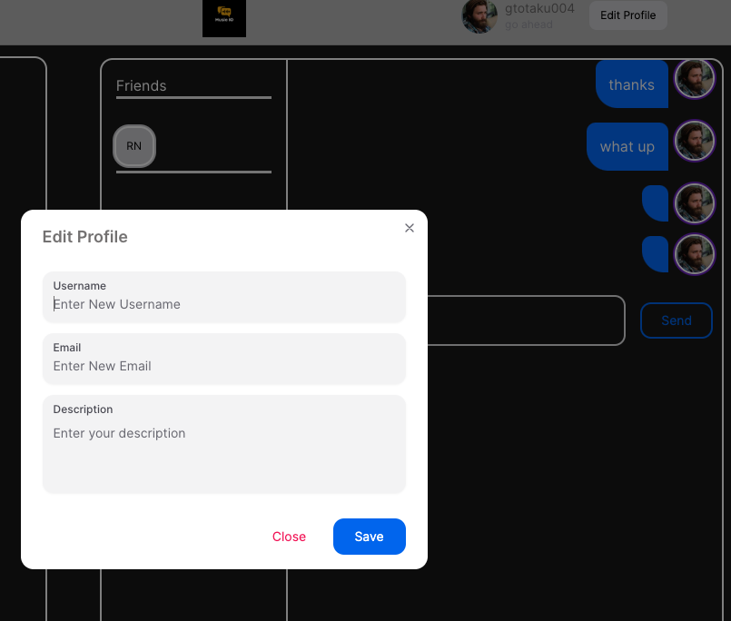

# Music  App  

 

## Table Of Contents

  * [Description](#description)
  * [Installation](#installation)
  * [Screenshots](#screenshots)
  * [Contributors](#contributors)
  * [License](#license)
   

## Desciption

- Music App is a platform where people can share their opinions about their favourite artists and make new friends with common music interests. 
- We wanted to develop a platform where it’s solely about music. 
- As a user we want to be able to create an account, listen to music,  add friends, and chat with the rest of

The application is deployed to [Heroku](https://musicapp-g7-8464089b4e0f.herokuapp.com/).

## Installation

For repo clone:  
(1) Run `npm install` to install NPM package manager  
(2) Run command `npm run build` then `npm start`  

## Screenshots:
- Starting page

- Spotify player with comments below

  
- Profile update page

- Navigation bar

## Contributors

Mae Ahmad - https://github.com/maeahmad
Sagenthave Senthan - https://github.com/Sagenthave
Rohit Nayyar - https://github.com/rohitwho
Wenbo Ni - https://github.com/WenboNi
Tian Guo - https://github.com/gtotaku-tg 

## License
MIT License A short and simple permissive license with conditions only requiring preservation of copyright and license notices. Licensed works, modifications, and larger works may be distributed under different terms and without source code.
